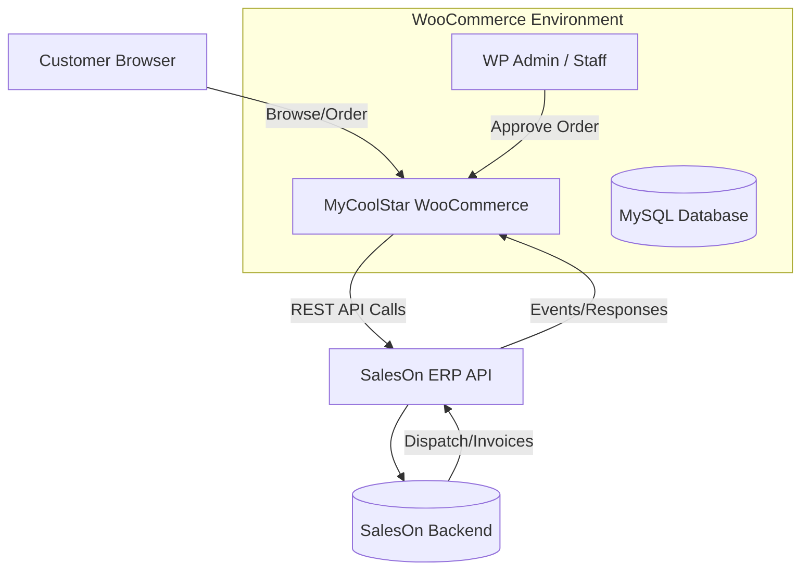

# Executive Summary  
Integrating SalesOn with MyCoolStar’s WooCommerce store is feasible and follows standard ecommerce‐ERP best practices. Key tasks include **discovery and planning**, identifying “source of truth” for each data domain, and mapping fields and events for sync. For example, WooCommerce migration guides emphasize a *“complete data inventory (products, customers, orders)”* and an *“integration map with technical details”* during discovery. SalesOn aims to unify orders, inventory, products, customers, and financial data into a single workflow, so our integration will mirror that goal: the store remains the **frontend** for browsing and ordering, while SalesOn remains the **backend** for stock, accounts, invoicing, and dispatch.  

In practice, the website will **push** new or updated data to SalesOn and **pull** updates (stock levels, invoices, payments, dispatch info) back into WooCommerce. All sync logic will handle retries, idempotency, and errors (e.g. API rate limits). A custom WooCommerce plugin will be developed (leveraging AI coding tools) to implement the sync. The plugin will store mapping tables and sync logs in custom database tables (created on activation) and provide an admin interface for configuration, logs, and manual resyncs. Based on the user’s profile (solo GenAI engineer), we estimate **~2–3 weeks** of focused work for a full MVP (with aggressive timeline possibly 8–10 days) to deliver product/customer sync, order handling, invoice and payment sync, and dispatch tracking. Extended features (advanced error handling, webhook support, extensive UI) could add more time. The recurring infrastructure cost is minimal: if built as a plugin, no new hosting is needed (just existing Woo store) – otherwise a small VPS (~₹500–1500/month) or serverless stack (~₹3k+) would be required, likely borne by the client.  

In summary, this plan covers everything needed to start development: detailed discovery and question checklists, an audit of the existing WooCommerce site, a catalog of SalesOn API endpoints to verify, templates for mapping and data flow, architecture options, security and testing considerations, a phased implementation roadmap, and a list of open issues. Wherever possible we cite official guidance: e.g., SalesOn advertises “real-time stock” and “bill-wise payment tracking”, while WooCommerce docs note that REST API requires Woo 3.5+/WP 4.4+. This ensures all parties have a firm technical starting point.  

## 1. Stakeholder & Meeting Checklist  
The first step is a structured discovery session.  Ask the client and SalesOn about each business domain (Products, Inventory, Customers, Orders, Payments, Invoices, Dispatch, etc.) to identify responsibilities and constraints. Key questions (grouped by area):  

- **Products:** Who creates or updates products and descriptions? Where are images and descriptions managed? (Likely on the website.) Where is SKU/ID defined? Are prices managed in SalesOn or on Woo? Are there multiple price lists or tiered pricing?  
- **Inventory:** Who updates stock levels (e.g. warehouse team via SalesOn)? How often does stock change, and is “real-time” needed or periodic sync OK? Does SalesOn expose an *“available stock”* or *on-hand vs reserved*? (Check if SalesOn has a stock report API.) How should out-of-stock situations be handled on the site?  
- **Customers (Parties):** Where are customer/dealer accounts created? Are they all pre-loaded in SalesOn, or do new customers sign up on the website? What are the unique keys (SalesOn Party ID, mobile, GST) for identifying a customer? Which fields do we need on Woo (name, address, GST, credit limit, current outstanding)? *Who “owns” the customer record?* (Typically the ERP.) How are address and contact updates managed? Who handles duplicate accounts or merging?  
- **Orders:** Exactly what is the current order workflow? E.g.: *Customer places order on site → it appears as “Pending” in WooCommerce (no invoice yet) → Sales team reviews → checks credit → confirms or requests payment*. Verify: Does the site already have a custom order status (“ORDER PENDING”) or note this step? How is a SalesOn Sales Order referenced (we’ll generate one after confirmation). Clarify: *No invoice is generated until SalesOn dispatches the order* (per requirements).  
- **Order Approval & Credit:** How is credit availability checked today? Where does “credit limit” and outstanding balance live? SalesOn may or may not have an API for credit data – we need to ask SalesOn. If the order exceeds credit, do they collect payment first? What are the manual steps?  
- **Payments:** How do customers pay (bank transfer, cheque, cash)? How are payments recorded? E.g. do employees use SalesOn to record payments, or do they enter them into the website? (We need both push and pull sync: website→SalesOn and SalesOn→website.) Ask: Can we fetch party balances/overdues via API? Is partial payment support needed?  
- **Invoicing & Dispatch:** Who generates the official tax invoice? (Requirements say SalesOn does, upon packing.) When an invoice is created in SalesOn, what data do we need to show on Woo (number, date, amount, PDF)? Can the invoice PDF be fetched via API? Who handles delivery challan / LR (transport docs)? Can a SalesOn API return the uploaded LR or transporter info? Clarify: *Workflow states*, e.g. “ORDER PACKED/PROCESSING → INVOICE GENERATED → DISPATCHED → DELIVERED”. Confirm each transition event and who triggers it.  
- **General Flow:** Why integrate? What pain points (e.g. manual entry, accuracy, credit control)? This will frame priorities.  
- **Questions for SalesOn Support:**  
  - **API Access & Auth:** How is API access provided (API key, token)? Is there a sandbox or test environment? Are there any costs for API usage?  
  - **Endpoints:** Which endpoints exist for Products, Stock Reports, Parties, Transactions (orders), Invoices, Payments, Shipments/Trips? Are there API docs or OpenAPI/Swagger? Sample payloads would help.  
  - **Inventory:** How to fetch current stock per SKU? (Stock Report API?)  
  - **Customers:** How to query/lookup parties? (e.g. GET /parties by mobile or GST). How to create a new party (POST /party) if needed? Is party grouping used (e.g. credit groups)?  
  - **Orders/Invoices:** Which endpoint creates a new sales order/transaction? How to mark status? Which endpoints list or retrieve invoices? Can the final tax invoice be generated or fetched via API (PDF)?  
  - **Payments:** How to create a payment entry via API (likely POST /payments)? How to list payments for a party? (We need confirmation that payment sync is two-way.)  
  - **Shipment/Dispatch:** What endpoints handle dispatch or delivery? E.g. is there /dispatch, /trip, /LR endpoints? Can we upload or fetch the LR/waybill PDF via API, or at least its reference number and date?  
  - **Webhooks:** Does SalesOn offer webhook callbacks for order status changes, payments, or invoices? (If yes, we can do real-time updates; if not, we’ll poll.)  
  - **Pagination & Limits:** Are list endpoints paginated? What are default page sizes and max? Any rate limits per minute/day? (This affects our polling strategy.)  
  - **Security:** Are API calls over HTTPS? How are API credentials secured?  
  - **Other:** Any gotchas, typical pitfalls, or SLA (support availability)?  

*(No strict citations for questions, but this draws on recommended integration scoping: e.g. verifying **data ownership** and field mapping.)*

## 2. As-Is Discovery: MyCoolStar Site Audit  
Gather technical details of the WooCommerce site to inform design and avoid conflicts. Key items to document:  

- **Access & Environment:** Obtain WP Admin and FTP/hosting credentials. Check WordPress and WooCommerce versions (WooCommerce 3.5+/WP 4.4+ required for the REST API). Ensure PHP, MySQL versions are modern.  
- **Theme & Design:** Identify active theme (e.g. via WP Admin or view source for theme CSS). Is it a custom theme or a purchased one (e.g. Woodmart, etc.)? Is it a child theme? Note any page builder (Elementor, WPBakery) or custom templates in use, especially on product, cart, checkout pages.  
- **Plugins:** List all installed plugins. Pay special attention to:  
  - WooCommerce extensions (e.g. payment gateways, shipping, custom checkout fields).  
  - Custom code plugins or snippets (e.g. custom checkout fields or validations).  
  - REST API / headless plugins (should not be needed as WC 3.5+ includes REST API).  
  - Inventory or stock management plugins (unlikely, since SalesOn handles stock).  
  - Security plugins (Wordfence, etc), backup/restore plugins, caching/SEO plugins.  
- **Checkout & Customers:** Note any customizations to the checkout flow (fields, multi-step). Is registration required to order? What user roles are defined (Admin, Shop Manager, Customer)? WooCommerce adds a *Customer* and *Shop Manager* role – ensure these are configured correctly.  
- **User Roles:** Check that only trusted employees have Administrator access. Others (order reviewers) should use the *Shop Manager* role, which allows order and product management but not full WP admin rights.  
- **Hosting & Security:** Note hosting type (shared, VPS, managed WP) and any CDNs. Ensure the site has a valid SSL certificate (HTTPS is needed for API security). Confirm backup schedule (daily/weekly) and storage location. Check if any Web Application Firewall or proxy is in place that might block external API calls. Scan for malware if not recently done.  
- **Performance/Size:** Roughly check site speed (Google PageSpeed) and DB size. If the site is heavy (lots of products or orders), plan for bulk sync performance.  
- **API Capability:** Verify that the WooCommerce REST API is enabled (should be on by default for WC3.5+). Confirm user account for integration has read/write permissions. The developer should have WP Admin rights to generate API keys if needed.  
- **Logging/Monitoring:** Check if any logging plugin or activity log is installed. If not, plan how to add plugin-specific logs (the integration plugin will need its own log storage).  

*(The audit should follow general WP checklist advice: keep WordPress and plugins up-to-date, ensure backups and security hardening, etc.)*  

## 3. SalesOn API Audit Checklist  
Review the SalesOn API documentation and test endpoints. Verify support for all required data flows. Checklist of areas to inspect:  

- **Authentication:** What auth method (API key header, JWT token, OAuth)? How to obtain/refresh tokens? Test a simple auth call.  
- **Product Endpoints:**  
  - **List Products:** e.g. `GET /products` or `/rate-lists` – can we retrieve SKU, name, category, price? Verify that each product has a unique ID or code (to map SKUs).  
  - **Stock/Inventory:** Check for endpoints like `GET /stock-report` or `/inventory`. Confirm they return available stock for each SKU. Some systems separate “on hand” vs “committed” stock – clarify what SalesOn provides.  
  - **Price Lists:** If SalesOn uses price lists or customer-specific pricing, note how to retrieve prices.  
- **Customer (Party) Endpoints:**  
  - **Get Parties:** `GET /parties`, possibly filtered by mobile or GST. Confirm fields: name, addresses, credit limit, outstanding, etc.  
  - **Create/Update Party:** If new customers can be added from Woo, test `POST /party` or similar. Identify primary keys (party_id).  
  - **Party Groups:** Are there customer groups or credit groups? Find endpoint for party group if needed.  
- **Sales Order (Transaction) Endpoints:**  
  - **Create Sales Order:** Likely `POST /transactions` or `/orders`. Confirm payload fields: party_id, items (product_id/SKU, qty, price), order reference. See if taxes/discounts can be passed or if they must be handled by SalesOn.  
  - **Order Status Update:** How to update order status (pending→confirmed) – maybe PATCH on a transaction or separate endpoint. Check if an initial “pending” order can be created and later confirmed or converted to invoice.  
  - **List Orders:** For reconciliation, any endpoint to list or get order by reference.  
- **Invoice Endpoints:**  
  - **Get Invoice:** `GET /invoices/{id}` – returns invoice number, date, amount, tax, etc.  
  - **List Invoices:** Ability to list invoices for a party or date.  
  - **Generate Invoice PDF:** Check if an endpoint like `GET /invoices/{id}/pdf` exists. (Some systems provide a URL or base64 PDF.) If not, plan to link the invoice number only.  
- **Payment Endpoints:**  
  - **Create Payment:** `POST /payments` – to record a cash/cheque/online payment against a party. Confirm fields: party_id, date, amount, mode.  
  - **List Payments:** `GET /payments?party_id=...` or similar, to fetch recent payments and remaining balance.  
  - **Payment Methods:** Any enumeration of payment modes (cash, cheque, UPI, etc).  
- **Dispatch / Logistics:**  
  - **Delivery/Shipment:** Look for endpoints such as `/shipment`, `/dispatch`, `/trip` – to retrieve shipping details like LR/bill number, date, transporter.  
  - **Upload Documents:** Check if API allows uploading LR or proof-of-delivery PDFs; if not, see if there’s an API to fetch a stored LR reference (number, date, transporter name).  
  - **Status Updates:** How SalesOn marks orders as dispatched or delivered – does it change the transaction status that we can poll?  
- **Other:**  
  - **Reports:** Is there a stock report API (e.g. `GET /report/stock`)? Are party outstanding reports exposed? Even if not needed, note their existence.  
  - **Webhooks (Push):** The docs likely do *not* mention webhooks (common in ERP). Confirm by searching for “webhook” in the API docs. If none, plan for periodic polling for updates.  
  - **Pagination/Filtering:** Check all list endpoints for `page` and `per_page` or filter params. Determine sensible poll intervals to avoid missing data.  
  - **Error Responses:** Note how the API reports errors (HTTP codes, body). Plan for retry/backoff on 5xx or rate-limit errors.  
  - **Sandbox/API Key Limits:** Ask if the SalesOn account has a sandbox and if any call quotas apply.  

*(No direct citations here, but the SalesOn marketing site confirms the system manages “inventory” and “bill wise payment tracking” – so these APIs should exist. Use any official documentation found to fill details.)*

## 4. Source-of-Truth Matrix (Template)  
Determine which system “owns” each piece of data. This avoids conflicts: e.g. SalesOn should control stock and credit, the website controls product descriptions and images, etc. For example:  

| **Entity**    | **Field**            | **Owner (Source)** | **Sync Direction**    | **Frequency / Trigger**   | **Conflict Policy**             |
|---------------|----------------------|--------------------|-----------------------|---------------------------|---------------------------------|
| **Product**   | SKU/Code             | SalesOn            | Mapped to Woo         | One-time mapping at start | Use SalesOn ID to map records   |
|               | Name, Description    | WooCommerce        | WooCommerce → SalesOn | On update / manual sync   | Woo text is authoritative       |
|               | Images               | WooCommerce        | N/A                   | N/A                       | Managed only on Woo site        |
|               | Price                | SalesOn (Price List) or Woo | SalesOn → Woo   | Periodic (e.g. nightly)  | SalesOn price authoritative     |
|               | Stock Quantity       | SalesOn            | SalesOn → Woo         | Near real-time / poll     | SalesOn stock authoritative     |
| **Customer**  | Party ID             | SalesOn            | Mapped to Woo user    | On import                | Use SalesOn Party ID as key     |
|               | Name, Mobile, GST    | SalesOn            | SalesOn → Woo         | On change / daily sync    | SalesOn authoritative           |
|               | Billing/Shipping Addr| SalesOn            | SalesOn → Woo         | On change / daily sync    | SalesOn authoritative           |
|               | Credit Limit         | SalesOn            | SalesOn → Woo (on check)| Real-time (API query)    | SalesOn authoritative           |
|               | Outstanding Balance  | SalesOn            | SalesOn → Woo         | On invoice/payment events  | Calculate from SalesOn data     |
| **Order**     | Woo Order ID         | WooCommerce        | Stores for mapping    | N/A                       | N/A                             |
|               | SalesOn Order ID     | SalesOn            | Stores in Woo order   | After SalesOn create      | N/A                             |
|               | Status (Pending/Confirmed) | Woo (pending), SalesOn (confirmed) | Woo→SalesOn, SalesOn→Woo | On admin confirm / invoice | SalesOn status held after invoice |
| **Invoice**   | Invoice Number       | SalesOn            | SalesOn → Woo         | On invoice creation      | SalesOn authoritative           |
|               | Invoice Date/Amount  | SalesOn            | SalesOn → Woo         | On invoice creation      | SalesOn authoritative           |
|               | Invoice PDF/URL      | SalesOn            | (if API allows)       | On invoice creation      | (Link only)                     |
| **Payment**   | Payment ID           | SalesOn            | Woo → SalesOn         | On record payment        | Prevent duplicate via unique ID |
|               | Amount/Mode/Date     | SalesOn            | Woo → SalesOn         | On record payment        | SalesOn authoritative           |
|               | Payment Status       | SalesOn            | SalesOn → Woo         | On payment event         | SalesOn authoritative           |
| **Dispatch**  | LR Number            | SalesOn            | SalesOn → Woo         | On dispatch              | SalesOn authoritative           |
|               | Transporter, Date    | SalesOn            | SalesOn → Woo         | On dispatch              | SalesOn authoritative           |
|               | LR Document (PDF)    | SalesOn            | SalesOn → Woo         | On dispatch              | (if API exists)                 |
| **Logs/Mappings** | Sync Logs, Mappings | Woo Plugin Tables | N/A               | On each sync/error      | Used for troubleshooting        |

>*Notes:* Each row shows which system is authoritative. For example, product descriptions and images live in WooCommerce, whereas stock levels and invoice data come from SalesOn. This aligns with the advice to choose one “trusted record” per data domain. Conflicts are resolved by trusting the designated owner (e.g. always overwrite Woo stock from SalesOn).  

## 5. Event Mapping Matrix (Template)  
Enumerate each integration trigger (event), direction, API endpoint, and related fields. Include error and retry policies. For instance:  

| **Trigger/Event**                      | **Direction**       | **SalesOn API Endpoint**            | **Key Payload/Fields**       | **Idempotency/Mapping**      | **Error/Retry**                            |
|----------------------------------------|---------------------|-------------------------------------|------------------------------|------------------------------|-------------------------------------------|
| **Woo: New Order Placed (Pending)**    | Woo → Woo           | N/A (internal)                     | Woo Order ID, items, total   | N/A                          | N/A (order is in Woo only)               |
| **Woo: Order Approved/Confirmed**      | Woo → SalesOn       | POST `/transactions`                | party_id, order_ref, items[] | idempotent by order_ref      | Retry on network error, alert on 4xx/5xx   |
| **SalesOn: Order Created (Ack)**       | SalesOn → Woo       | N/A (immediate)                    | returns SalesOn Order ID     | Map SalesOnOrderID → Woo     | Log if Woo order not found               |
| **Woo: Payment Recorded**              | Woo → SalesOn       | POST `/payments`                    | party_id, amount, date, mode | idempotent by payment ref    | Retry on failure, prevent duplicates     |
| **SalesOn: Payment Update**            | SalesOn → Woo       | GET `/payments?party_id=...`        | amount, balance             | Map by party and date        | If missing, schedule next poll           |
| **SalesOn: Invoice Generated**         | SalesOn → Woo       | GET `/invoices/{invoice_id}`        | invoice_number, total, date  | Map by SalesOnOrderID        | Log if Woo order missing, require manual fix |
| **SalesOn: Delivery Challan (LR) Added** | SalesOn → Woo     | GET `/dispatch/{order_id}`          | lr_number, transporter, date | Map by SalesOnOrderID        | Log if API fails, retry on polling       |

*Mapping rules:* Use SalesOn’s unique IDs (e.g. product IDs for SKU, party IDs for customers) as cross-reference. Generate or attach idempotency keys where supported (e.g. use the Woo order number as a reference when creating SalesOn orders) to prevent duplicates. Handle errors per best practices (retry transient failures, log and notify on permanent failures). Dazzlebirds recommends planning for failed syncs, missing fields, and duplicate records – our matrix should note where to catch and resolve these.  

## 6. Data Model & DB Mapping  
The integration plugin will add its own tables to WordPress to store SalesOn IDs and logs. Suggested tables: 

```sql
-- Map Woo Customer to SalesOn Party
CREATE TABLE wp_saleson_customers (
  id BIGINT NOT NULL AUTO_INCREMENT PRIMARY KEY,
  woo_customer_id BIGINT NOT NULL,
  saleson_party_id VARCHAR(100) NOT NULL,
  UNIQUE KEY (woo_customer_id)
);

-- Map Woo Order to SalesOn Transaction/Invoice
CREATE TABLE wp_saleson_orders (
  id BIGINT NOT NULL AUTO_INCREMENT PRIMARY KEY,
  woo_order_id BIGINT NOT NULL,
  saleson_order_id VARCHAR(100),
  saleson_invoice_id VARCHAR(100),
  UNIQUE KEY (woo_order_id)
);

-- Map Woo Order to SalesOn Payment
CREATE TABLE wp_saleson_payments (
  id BIGINT NOT NULL AUTO_INCREMENT PRIMARY KEY,
  woo_order_id BIGINT,
  saleson_payment_id VARCHAR(100),
  UNIQUE KEY (saleson_payment_id)
);

-- Sync and Error Logs
CREATE TABLE wp_saleson_sync_logs (
  id BIGINT NOT NULL AUTO_INCREMENT PRIMARY KEY,
  timestamp DATETIME NOT NULL,
  direction ENUM('Woo→SalesOn','SalesOn→Woo') NOT NULL,
  endpoint VARCHAR(255),
  request TEXT,
  response TEXT,
  status_code INT,
  error TEXT
);
```

Use WordPress’s `$wpdb` with `dbDelta` on plugin activation to create/update these tables. Store SalesOn IDs (party_id, order_id, invoice_id, payment_id) for each Woo record. Also store any raw sync request/response for debugging in `wp_saleson_sync_logs`. Each Woo order can then be linked to its SalesOn records via these tables.  

## 7. Integration Architecture Options  
Three main architectures are possible:

- **Plugin-only (Recommended for Solo Freelancer):** A custom WordPress plugin embeds all logic within WooCommerce. It calls the SalesOn API directly (using WordPress HTTP or PHP cURL). **Pros:** No extra infrastructure; deployment as simple as uploading the plugin; costs are limited to existing hosting. Can leverage WP Cron (`wp_schedule_event`) for polling. **Cons:** Puts load on the WP site (polling tasks); harder to reuse for other projects. Overall, simplest for a small-scale store.  
- **Middleware Service (e.g. Node.js/Laravel):** A separate server/service mediates between Woo and SalesOn. Woo uses webhooks or API calls to the middleware, which then calls SalesOn. **Pros:** Decouples systems; easier to scale/police retries; can use dedicated queuing and caching. **Cons:** Requires hosting a server or VPS (cost ~₹500–1500/month minimum), plus DB (Postgres/MySQL). More complex setup (CORS, SSL, user management). For this one-off project, likely overkill unless SalesOn imposes strict limits.  
- **Serverless (API Gateway + Lambdas):** Deploy integration functions on cloud (AWS Lambda/GCP Cloud Functions). **Pros:** Pay-per-use, auto-scaling. **Cons:** Cold-start latency, debugging difficulty, limits on execution time/memory, complexity of setting up triggers. Cold functions may not maintain state easily (would still need a DB). For frequent small updates, costs can climb. Not ideal given the developer is a single freelancer working off a WP site.  

**Recommended Choice:** **Plugin-only**. It minimises recurring cost and complexity. All logic lives in the existing site’s codebase. For example, the plugin can use WordPress HTTP API to call SalesOn and WP Cron for scheduled tasks. No additional server is needed, so ongoing infra cost is essentially zero beyond current hosting.  



This diagram shows the customer and admin interacting with WooCommerce, which in turn calls SalesOn’s API. SalesOn’s responses (invoice numbers, dispatch info) flow back to update the Woo site. 

## 8. Security, Auth, Logging, Monitoring, Admin UI  
- **Authentication:** Store the SalesOn API credentials (e.g. API key/secret or tokens) in the plugin settings (using `wp_options` with `autoload=false`). Always connect over HTTPS. If SalesOn uses tokens, implement token caching and refresh.  
- **Secrets Management:** Ensure the WP `wp-config.php` or the options database have secure permissions. Consider using environment variables or WP’s built-in encryption for sensitive data. Limit API key scope if possible.  
- **User Permissions:** Only Admins (or a specially defined integration role) should access the plugin’s settings. The integration might use a Shop Manager or Admin account to generate Woo REST API keys for any external use. (WooCommerce’s Shop Manager role can manage orders/products but not alter code.)  
- **Logging:** Use the custom `wp_saleson_sync_logs` table above to record every API request and response (or error). This provides an audit trail. Include timestamps, endpoints, payloads, status codes, and error messages. Logging uncaught exceptions in the plugin code is vital.  
- **Monitoring:** Since no external service is used, logging is the primary monitor. Optionally send email alerts (or Slack/webhook) on critical failures (e.g. 5 failed payments sync in a row).  
- **Retry Mechanism:** For transient errors (network timeouts, 5xx from SalesOn), implement exponential backoff and retry (e.g. retry up to 3 times then log failure). For rate-limit errors, respect any `Retry-After`. The user interface should allow manual re-sync.  
- **Admin UI:** The plugin should add a WooCommerce settings page for: SalesOn API credentials, sync intervals, and toggles (e.g. enable/disable specific sync flows). Also add meta-boxes or columns on orders to display linked SalesOn Order/Invoice IDs. Include a “Resync” button on orders (in case manual fix is needed). Create an admin submenu for **Sync Logs** (view raw logs with filters) and **Mappings** (show linked customer/order IDs).  

*(WordPress best practices: create tables on activation, use nonces and capabilities checks in admin pages, and sanitize all inputs.)*

## 9. Testing Plan  
A thorough testing strategy is essential. Steps should include:

- **Sandbox Environment:** Use a staging copy of the website and a SalesOn test account. Test credentials should be included in plugin config.  
- **Unit/Integration Tests:** If possible, write automated tests (using PHPUnit or WP CLI) that simulate API calls (mock SalesOn) for core functions (e.g. mapping customers, pushing orders). Use dummy responses to verify parsing logic.  
- **Manual End-to-End Tests:** Walk through all scenarios on sandbox:  
  1. Sync products and verify stock/prices appear correctly on Woo.  
  2. Create a new customer on SalesOn, run sync, check Woo user created/updated.  
  3. Place a Woo order, leave pending; confirm it appears only on Woo.  
  4. Approve order (admin) → trigger SalesOn order creation → check SalesOn received correct data.  
  5. Generate a payment in Woo → confirm it appears in SalesOn.  
  6. Apply a payment in SalesOn (in sandbox) → run sync → confirm Woo shows updated balance/credit.  
  7. In SalesOn, finalize dispatch and invoice → run sync → confirm Woo shows invoice details (number, PDF link, etc) and “Dispatched” status with LR info.  
  8. Test edge cases: 
     - Order exceeding credit limit (should remain pending in Woo). 
     - Partial payments and then full payment. 
     - Network/API failures: see that errors are logged and no data is lost.  
- **Rollback and Resync:** Ensure that any failed transaction can be retried manually. For example, if pushing an order fails due to network, the admin should be able to click a “Retry” that re-attempts the API call (reading from logs). Document how to clear / re-trigger the sync for each step.  
- **Performance:** Test with bulk data (e.g. 100 orders, 1000 products) to ensure sync loops finish in a reasonable time. Tune batch sizes or cron intervals as needed.  
- **Security Testing:** Verify no sensitive data (SalesOn keys) is exposed. Confirm all API calls go over HTTPS.  

*(This aligns with WooCommerce advice to test key customer paths like order flows and inventory syncs, and to prepare for exception handling.)*

## 10. Implementation Roadmap & Sprints  

| **Phase**             | **Key Tasks / Deliverables**                                         | **Days** (est.)              |
|-----------------------|---------------------------------------------------------------------|------------------------------|
| **Phase 1:** Setup    | WP/Woo environment prep (WP CLI, plugin boilerplate); write discovery docs (current state, SoT matrix, event maps). | 1–2 days |
| **Phase 2:** Products | Implement SalesOn client and authentication. Fetch product list & stock via SalesOn API and update Woo product stock fields. Test with a few products. | 2–3 days |
| **Phase 3:** Customers| Sync existing SalesOn parties to Woo users/customers (match by mobile/GST). Create WP user if missing. Map IDs in DB. | 2 days  |
| **Phase 4:** Orders   | Handle Woo new orders: store as ‘Pending’. On admin confirm, push to SalesOn via API (POST transaction). Map SalesOn order ID. | 3 days  |
| **Phase 5:** Payments | Add Woo admin UI to record payments → push to SalesOn (POST payment). Also poll SalesOn for incoming payments. Update Woo outstanding/credit. | 2–3 days |
| **Phase 6:** Invoices | Poll SalesOn for invoices (or respond via webhook if available). Update Woo order with invoice number, date, amount. Save or link PDF. Update status to “Invoice Generated”. | 2 days  |
| **Phase 7:** Dispatch| Poll SalesOn for dispatch info (LR number, transporter, date). Attach to Woo order and set status “Dispatched”→ “Delivered”. | 2 days  |
| **Phase 8:** Admin UI| Build plugin settings page, logs viewer, mapping tables (customer/order). Add “Resync” buttons and status indicators. | 2–3 days |
| **Phase 9:** Testing  | Execute test plan, fix bugs. Prepare documentation (setup instructions, config guide). | 3 days |
| **Total:**           |                                                                     | **~17–20 days** (conservative) |

Given your expertise and AI coding tools, the timeline can be optimistic. We estimate: **Conservative: ~18–25 working days**, **Realistic: ~12–15 days**, **Aggressive: ~8–10 days** to reach a production-ready state. We assume most work is coding and testing (AI tools can speed up boilerplate and API wiring), not lengthy requirements gathering.  

*(For context, WooCommerce migrations often plan detailed schedules. Adjust above once discovery is complete.)*

## 11. Risk Register & Open Questions  

- **Unknown API Capabilities:** If SalesOn lacks certain endpoints (e.g. invoice PDF download, real-time webhooks, credit check), we may need workarounds or manual steps. *Mitigation:* Confirm capabilities up front, and design fallback (e.g. periodic polling for invoice info if no webhook).  
- **Data Conflicts:** Duplicate customers or mismatched SKUs could cause sync errors. *Mitigation:* In mapping logic, first attempt to match by unique fields (mobile/GST for customer, SKU for product). Log unmatched records for manual review. Prevent duplicate creations by checking SalesOn Party ID mapping.  
- **API Rate Limits/Errors:** If SalesOn limits calls, heavy polling may hit limits. *Mitigation:* Batch requests, respect any headers (Retry-After). Implement retry with backoff on 5xx errors.  
- **Performance Issues:** Large data sets (hundreds of products/orders) could slow sync. *Mitigation:* Use incremental sync (only changed records) and efficient queries. Profile and optimize as needed.  
- **Dependency Risks:** The integration relies on SalesOn uptime and API stability. *Mitigation:* Ensure the plugin handles API failures gracefully (e.g. queue for retry, alert admin).  
- **Security Risks:** Exposing API keys or using unsecured endpoints could be dangerous. *Mitigation:* Always use HTTPS, store keys securely, rotate keys periodically.  
- **Open Questions (to verify):** 
  - **Credit Limit API:** Can we fetch a customer’s credit limit and outstanding balance in real time? If not, credit checks must remain manual in SalesOn.  
  - **Payment Sync:** Does SalesOn send payment events or must we poll? Can a payment be applied to multiple invoices (partial payments)?  
  - **Invoice PDFs/LR Docs:** Are these retrievable via API (e.g. as URLs or base64)? If not, how else can customers see them on the site?  
  - **Webhook Support:** Any real-time triggers from SalesOn (orders, invoices, payments)?  
  - **Rate Limits:** Is there a documented limit on requests/sec or per day?  
  - **SalesOn Plan/Costs:** Does API access require a higher subscription tier?  

*(As Dazzlebirds notes, make sure to plan for missing fields and exceptions ahead of time. Each open question should be answered before or early in development to avoid rework.)*  

## 12. Deliverables Checklist & Handover  

At project completion, provide the client with:  

- **Plugin Code:** The fully documented WordPress plugin (PHP files), ready to install. Include source repository (GitHub or zip).  
- **Documentation:** 
  - A system architecture diagram (like above). 
  - The completed Source-of-Truth and Event Mapping tables (as in sections 4-5). 
  - Setup guide for plugin (install, configure API keys). 
  - Instructions for manual resync or troubleshooting.  
- **Test Results:** A report or list of tests performed (the testing plan checklist, test data used, and outcomes).  
- **Admin Training:** Notes on how to use the new features: approving orders, processing payments, viewing invoices/dispatch in the Woo admin, and how to check logs.  
- **Access & Credentials:** Ensure the client has all necessary API credentials and that the WP site keys are stored on their system, not tied to the developer’s account.  
- **License Info:** If any third-party libraries/plugins were used (e.g. Wordfence, ACF), provide their license requirements.  
- **Go-Live Plan:** Recommend schedule (e.g. deploying on staging first, doing a full backup, then switching). Ensure a rollback plan is defined (e.g. how to disable sync if needed).  
- **Support Period:** Clarify any warranty or support period for fixing integration issues post-launch.  

With these deliverables, the client will have everything needed to maintain and extend the integration in future. All custom code and settings will be documented and tested, and the path to production will be clear. 

